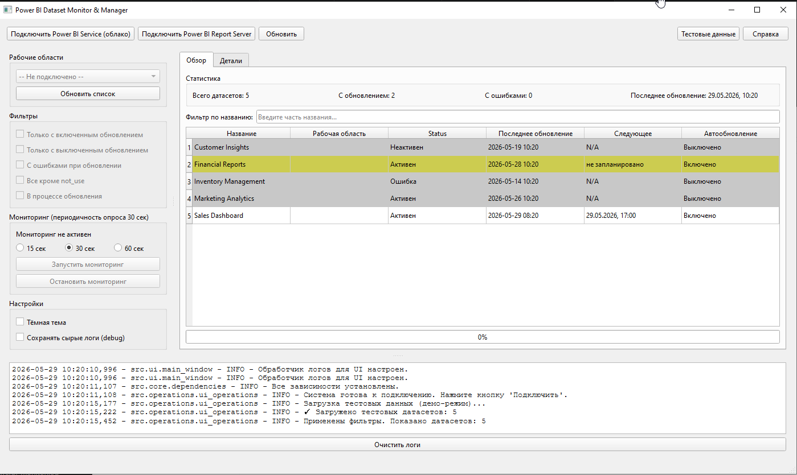
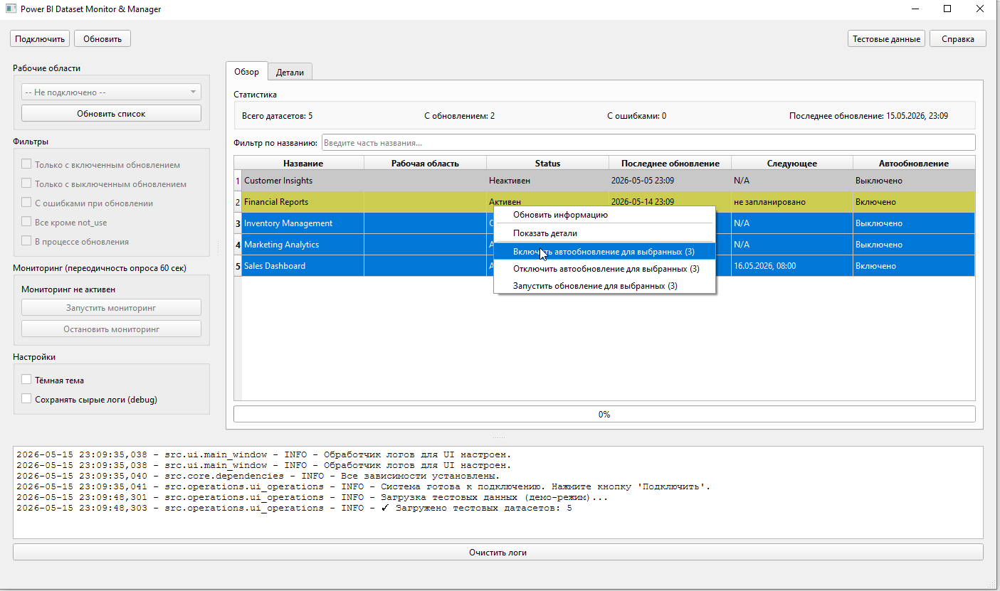
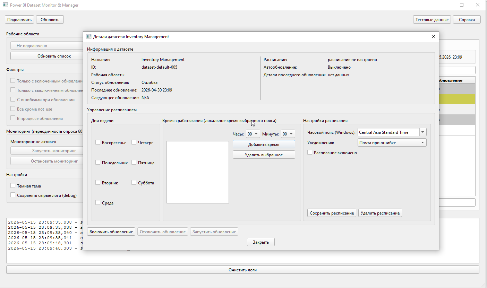
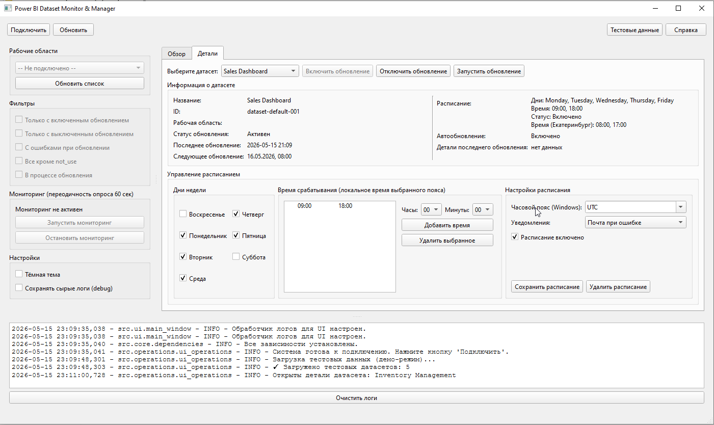
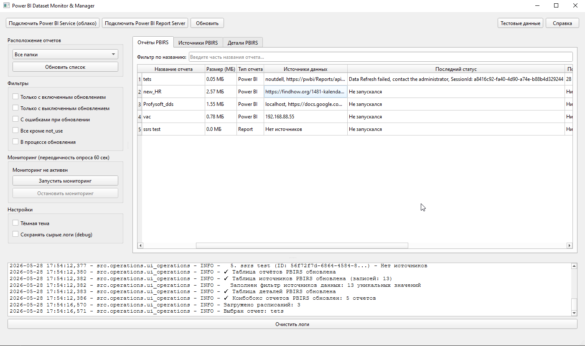
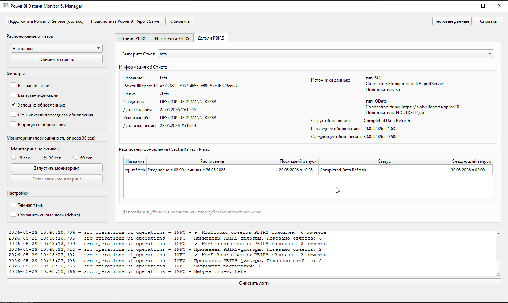

# Power BI Dataset Monitor & Manager

[](https://python.org)
[](https://riverbankcomputing.com/software/pyqt/)

Приложение для мониторинга и управления датасетами Microsoft Power BI Service, а также отчётами Power BI Report Server (PBIRS).

## 📋 Оглавление

- [Возможности](#-возможности)
- [Требования](#-требования)
- [Установка и запуск](#-установка-и-запуск)
- [Интерфейс](#-интерфейс)
- [Работа с Power BI Service (облако)](#-работа-с-power-bi-service-облако)
- [Работа с Power BI Report Server (PBIRS)](#-работа-с-power-bi-report-server-pbirs)
- [Дополнительные возможности](#-дополнительные-возможности)
- [Скриншоты](#-скриншоты)
- [Решение проблем](#-решение-проблем)
- [Контакты](#-контакты)

## 🚀 Возможности

- **Подключение к Power BI Service** — интерактивная аутентификация (Azure CLI или браузер).
- **Подключение к Power BI Report Server** — NTLM-аутентификация (текущий пользователь Windows или явные учётные данные).
- **Управление датасетами (облако)** — просмотр рабочих областей, датасетов, статусов обновлений, расписаний.
- **Управление отчётами PBIRS** — просмотр отчётов, источников данных, планов обновления кэша (Cache Refresh Plans).
- **Редактирование расписаний** — дни недели, время, часовой пояс, уведомления, включение/отключение.
- **Пакетные операции** — массовое включение/отключение/обновление датасетов.
- **Мониторинг в реальном времени** — автоматическое обновление данных с заданной периодичностью (15/30/60 сек).
- **Фильтрация** — по статусу, имени, ошибкам, исключению `not_use`, процессу обновления.
- **Тёмная/светлая тема**.
- **Сохранение сырых логов API** для отладки (каталог `debug/`).
- **Тестовые данные** — демонстрация работы без реального подключения.

## 📦 Требования

- **Python** 3.8 или выше
- **Библиотеки** (устанавливаются автоматически при первом запуске):
  - `azure-identity`, `msal`, `requests`, `requests_ntlm`, `PyQt5`, `python-dateutil`
  - Зависимости объявлены в `pyproject.toml` (`pip install -e .`)

## 🛠 Установка и запуск

1. Клонируйте репозиторий:
   ```bash
   git clone https://github.com/your-repo/powerbi-monitor.git
   cd powerbi-monitor
   ```

2. Запустите приложение:
   ```bash
   python main.py
   ```

   При первом запуске `DependencyManager` автоматически проверит и установит все необходимые пакеты. Скрипт может перезапуститься после установки.

## 🖥 Интерфейс

- **Верхняя панель** — кнопки подключения, обновления, тестовых данных и справки.
- **Левая панель** — выбор рабочей области/папки, фильтры, настройки мониторинга, тема, отладка.
- **Центральная область** — вкладки в зависимости от режима (Обзор, Детали, Отчёты PBIRS, Источники PBIRS, Детали PBIRS, История, Логи).
- **Нижняя панель** — текстовый лог всех действий (очищается кнопкой).

Переключение между режимами (облако / сервер) происходит автоматически при нажатии соответствующей кнопки подключения.

## ☁ Работа с Power BI Service (облако)

### Подключение

1. Нажмите **«Подключить Power BI Service (облако)»**.
2. Выполните вход через Azure CLI или браузер.
3. После успешной аутентификации загрузятся рабочие области и датасеты.

### Вкладка «Обзор»

- **Статистика**: всего датасетов, с включённым обновлением, с ошибками.
- **Фильтр по названию** — поиск датасета.
- **Таблица датасетов**:
  - Название, рабочая область, статус, последнее обновление, следующее запланированное, статус автообновления.
  - Цветовая индикация: красный (ошибка), серый (выключено), жёлтый (нет расписания).
- **Действия**:
  - Двойной клик — детальный диалог с полной информацией и управлением расписанием.
  - Контекстное меню (правый клик) — включить/отключить/обновить выбранные датасеты (поддерживается множественный выбор).

### Вкладка «Детали»

- Выбор датасета из выпадающего списка.
- Кнопки: **Включить обновление**, **Отключить обновление**, **Запустить обновление**.
- Детальная информация в два столбца.
- **Управление расписанием**:
  - Дни недели (чекбоксы).
  - Список времени срабатывания (добавление/удаление).
  - Часовой пояс (Windows), уведомления, чекбокс «Расписание включено».
  - Кнопки **«Сохранить расписание»** и **«Удалить расписание»**.

### Мониторинг и фильтры (левая панель)

**Фильтры:**
- Только с включенным обновлением.
- Только с выключенным обновлением.
- С ошибками при обновлении.
- Все кроме `not_use`.
- В процессе обновления.

**Мониторинг** — выбор интервала (15/30/60 сек), запуск/остановка автоматического обновления данных.

## 🖥 Работа с Power BI Report Server (PBIRS)

### Подключение

1. Нажмите **«Подключить Power BI Report Server»**.
2. Введите URL сервера (например, `http://PBIRSServer/Reports`).
3. Выберите тип авторизации: **Windows** (текущий пользователь) или **явный логин/пароль**.
4. После проверки подключения загрузятся отчёты и источники данных.

### Вкладка «Отчёты PBIRS»

- **Таблица отчётов**: папка, название, размер, тип, источники данных (кратко, tooltip с полными строками), статус, последнее/следующее обновление.
- **Фильтр по названию отчёта** — текстовый поиск.
- **Фильтр по папке** — выбор папки в левом комбобоксе (работает на все три PBIRS-вкладки).
- **Фильтры-чекбоксы** (левая панель):
  - Без расписаний.
  - Без аутентификации.
  - Успешно обновлённые.
  - С ошибками последнего обновления.
  - В процессе обновления.
- **Двойной клик** — диалог с полной информацией об отчёте (включая все планы обновления кэша).

### Вкладка «Источники PBIRS»

- Детальный список каждого источника данных (ConnectionString) с привязкой к отчёту.
- **Колонки**: папка, отчёт, источник (сокращённый, tooltip с полным), тип (Kind), дата изменения, пользователь.
- **Фильтры**: по названию отчёта, по источнику (ConnectionString), по типу (мультивыбор), по пользователю.

### Вкладка «Детали PBIRS»

- Выбор отчёта из выпадающего списка (отображается полный путь).
- Блок информации об отчёте в два столбца.
- **Таблица планов обновления кэша** (Cache Refresh Plans): название, расписание (читаемое), последний запуск, статус, следующий запуск.
- **Контекстное меню таблицы** (правый клик):
  - **Создать расписание** — диалог: название, периодичность (ежедневно/еженедельно), дни недели, время запуска.
  - **Обновить сейчас** — немедленный запуск плана.
  - **Удалить расписание** — удаление плана.

## ⚙ Дополнительные возможности

- **Тестовые данные** — кнопка на верхней панели для загрузки фиктивных датасетов (без подключения к Power BI).
- **Тёмная тема** — чекбокс в левой панели.
- **Сохранение сырых логов** — чекбокс создаёт каталог `debug/` и сохраняет JSON-ответы API (полезно для отладки).
- **Логи** — отображаются в нижней панели и дублируются в файл `powerbi_monitor.log`.

## 📸 Скриншоты









## ❓ Решение проблем

| Проблема | Решение |
|----------|---------|
| Ошибка аутентификации (облако) | Выполните `az login` или используйте интерактивный браузер. Убедитесь, что у вас есть доступ к Power BI. |
| Нет рабочих областей | Проверьте лицензию (Pro/Premium) и права доступа. |
| Ошибка 403 при включении обновления | Недостаточно прав. Требуется роль «Участник» или «Администратор» рабочей области. |
| Неправильное время в расписании | Для облака по умолчанию конвертация из UTC+6 в UTC+5 (Екатеринбург). Измените смещения в `data_loading_ops.py` и `time_utils.py`. |
| Не загружаются планы обновления PBIRS | Убедитесь, что у отчёта есть Cache Refresh Plans и у вас есть права. Проверьте логи на ошибки 404/500. |
| Ошибка подключения к PBIRS | Проверьте URL, доступность сервера и NTLM-аутентификацию. Используйте формат `домен\\пользователь`. |
| Предупреждение «не назначен пользователь» при создании расписания | Назначьте учётные данные для источника данных в веб-интерфейсе сервера (ссылка предлагается в диалоге). |

## 📞 Контакты

По вопросам доработки, сообщениям об ошибках или предложениям обращайтесь **@BDV_80** (Telegram).

---

**Версия:** 1.0.0  
**Дата:** Май 2026
