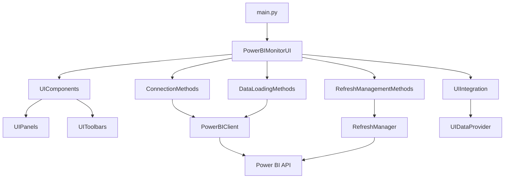

# Power BI Dataset Monitor & Manager

Приложение для мониторинга и управления датасетами Power BI через графический интерфейс на PyQt6.

## Возможности

- **Подключение к Power BI**: Аутентификация через Azure Interactive Browser или Azure CLI
- **Просмотр рабочих областей и датасетов**: Иерархическое отображение всех доступных ресурсов
- **Управление обновлениями**:
  - Включение/отключение автоматического обновления
  - Настройка расписания обновлений
  - Ручной запуск обновлений
- **Мониторинг статуса обновлений**: Отслеживание текущих и исторических операций обновления
- **Фильтрация и поиск**: Поиск по имени, фильтрация по статусу, типу обновления
- **Темы оформления**: Светлая и тёмная темы
- **Логирование**: Встроенное окно логов с возможностью сохранения в файл

## Архитектура

Проект построен по модульному принципу с разделением ответственности:

```
d:/PBI_DATA/
├── main.py                    # Точка входа
├── requirements.txt           # Зависимости Python
├── docs/                      # Документация
└── src/                       # Исходный код
    ├── core/                  # Бизнес-логика и работа с API
    │   ├── powerbi_client.py  # Клиент Power BI API
    │   ├── refresh_manager.py # Менеджер обновлений
    │   ├── refresh_operations.py # Операции обновления
    │   ├── dependencies.py    # Управление зависимостями
    │   ├── connection_manager.py # Менеджер подключений
    │   └── data_provider.py   # Провайдер данных
    ├── ui/                    # Пользовательский интерфейс
    │   ├── main_window.py     # Главное окно
    │   ├── ui_components.py   # Фасад UI компонентов
    │   ├── ui_panels.py       # Панели интерфейса
    │   ├── ui_toolbars.py     # Панели инструментов
    │   ├── theme_colors.py    # Темы оформления
    │   └── methods/           # Методы UI (MVC-подобные контроллеры)
    │       ├── connection.py      # Методы подключения
    │       ├── data_loading.py    # Загрузка данных
    │       ├── event_handlers.py  # Обработчики событий
    │       ├── filtering.py       # Фильтрация
    │       ├── monitoring.py      # Мониторинг
    │       ├── refresh_management.py # Управление обновлениями
    │       ├── ui_state.py        # Состояние UI
    │       ├── help_methods.py    # Справка
    │       └── progress_manager.py # Управление прогрессом
    └── integration/           # Интеграционный слой
        └── ui_integration.py  # Интеграция UI с бизнес-логикой
```

### Диаграмма взаимодействия компонентов



## Установка и запуск

### Предварительные требования

- Python 3.8+
- Активная подписка Azure с доступом к Power BI
- Права на управление датасетами в Power BI

### Установка зависимостей

```bash
pip install -r requirements.txt
```

### Запуск приложения

```bash
python main.py
```

## Использование

1. **Запустите приложение** - откроется главное окно.
2. **Нажмите "Подключить"** - выполнится аутентификация в Power BI.
3. **Выберите рабочую область** из выпадающего списка.
4. **Выберите датасет** из таблицы или дерева.
5. **Управляйте обновлениями**:
   - Включите/отключите автоматическое обновление
   - Настройте расписание
   - Запустите ручное обновление
6. **Мониторьте статус** во вкладке "Мониторинг обновлений".

## Конфигурация

### Методы аутентификации

Приложение поддерживает два метода аутентификации:
1. **Interactive Browser** - откроет браузер для входа
2. **Azure CLI** - использует существующую сессию Azure CLI

### Сохранение сырых данных

Для отладки можно включить сохранение сырых ответов API. Для этого в `src/ui/methods/connection.py` установите:

```python
debug_data_path = r"C:\temp\work\PBI_DATA\data"
```

## Разработка

### Структура кода

Проект использует паттерн "Методы" (Methods) для разделения логики UI. Каждый класс в `src/ui/methods/` отвечает за определённую функциональность:

- **ConnectionMethods** - подключение и инициализация
- **DataLoadingMethods** - загрузка данных из API
- **RefreshManagementMethods** - управление обновлениями
- **EventHandlers** - обработка событий UI
- **FilteringMethods** - фильтрация и поиск
- **MonitoringMethods** - мониторинг статусов
- **UIStateMethods** - управление состоянием интерфейса
- **HelpMethods** - справка и информация
- **ProgressManager** - управление прогресс-барами

### Добавление новой функциональности

1. Создайте новый класс методов в `src/ui/methods/`
2. Импортируйте его в `src/ui/main_window.py`
3. Добавьте экземпляр класса в `PowerBIMonitorUI.__init__`
4. Свяжите методы с элементами UI через сигналы/слоты

### Тестирование

На данный момент тесты отсутствуют. Рекомендуется добавить:
- Модульные тесты для `core/`
- Интеграционные тесты для API
- UI-тесты с использованием QtTest

## Известные проблемы и ограничения

1. **Отсутствие тестов** - код не покрыт автоматическими тестами
2. **Нет конфигурационного файла** - настройки хардкодены в коде
3. **Отсутствует обработка сетевых ошибок** - некоторые сценарии могут приводить к падению приложения

## Планы развития

1. **Добавление тестов** - покрытие unit и integration тестами
2. **Конфигурационный файл** - вынос настроек в YAML/JSON
3. **Расширенная обработка ошибок** - graceful degradation при сбоях API


