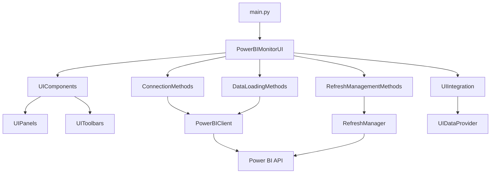

# Power BI Dataset Monitor & Manager

Приложение для мониторинга и управления датасетами Power BI через графический интерфейс на PyQt6.
markdown

## Возможности

- **Подключение к Power BI**: Аутентификация через Azure Interactive Browser или Azure CLI
- **Просмотр рабочих областей и датасетов**: Иерархическое отображение всех доступных ресурсов
- **Управление обновлениями**:
  - Включение/отключение автоматического обновления
  - Настройка расписания обновлений
  - Ручной запуск обновлений
- **Мониторинг статуса обновлений**: Отслеживание текущих и исторических операций обновления
- **Фильтрация и поиск**: Поиск по имени, фильтрация по статусу, типу обновления
- **Темы оформления**: Светлая и тёмная темы
- **Логирование**: Встроенное окно логов с возможностью сохранения в файл
- **Демо-режим для тестирования**: Загрузка фиксированных тестовых данных для демонстрации и скриншотов без подключения к Power BI
- **Оптимизированный интерфейс** (май 2026):
  - Панель логов в нижней части окна для постоянной видимости
  - Вкладка "Детали" с двухколоночным представлением информации о датасете
  - Управление расписанием с днями недели в две колонки и списком времени в две колонки по 6 строк
  - Панель добавления нового времени справа от списка (часы, минуты, кнопки)
  - Фильтр выбора датасета выпадающим списком
  - Кнопки "Справка" и "Тестовые данные" в правой части панели инструментов

## Архитектура

Проект построен по модульному принципу с разделением ответственности:

```
d:/PBI_DATA/
├── main.py                    # Точка входа
├── requirements.txt           # Зависимости Python
├── docs/                      # Документация
├── debug/                     # Каталог для сохранения сырых логов (игнорируется Git)
└── src/                       # Исходный код
    ├── core/                  # Бизнес-логика и работа с API
    │   ├── powerbi_client.py  # Клиент Power BI API
    │   ├── refresh_manager.py # Менеджер обновлений
    │   ├── dependencies.py    # Управление зависимостями
    │   ├── connection_manager.py # Менеджер подключений
    │   ├── connection.py      # Методы подключения (перемещено из ui/methods)
    │   └── data_provider.py   # Провайдер данных
    ├── ui/                    # Пользовательский интерфейс
    │   ├── main_window.py     # Главное окно
    │   ├── ui_components.py   # Фасад UI компонентов
    │   ├── ui_panels.py       # Панели интерфейса
    │   ├── ui_toolbars.py     # Панели инструментов
    │   ├── theme_colors.py    # Темы оформления
    │   ├── schedule_editor_dialog.py # Диалог редактирования расписания
    │   └── widgets/           # Переиспользуемые виджеты
    │       ├── __init__.py
    │       └── factories.py
    ├── operations/            # Классы операций (объединение методов UI)
    │   ├── base_operations.py # Базовый класс операций
    │   ├── data_loading_ops.py # Загрузка данных
    │   ├── data_filtering_ops.py # Фильтрация и мониторинг
    │   ├── refresh_operations.py # Управление обновлениями и прогресс-бар
    │   └── ui_operations.py   # Операции UI и обработчики событий
    ├── test_data/             # Тестовые данные для демо-режима
    │   ├── mock_connections.py # Фиктивные подключения
    │   └── debug_data.py      # Логика сохранения сырых данных
    ├── utils/                 # Утилиты
    │   └── time_utils.py      # Функции работы со временем
    └── integration/           # Интеграционный слой
        └── ui_integration.py  # Интеграция UI с бизнес-логикой
```

### Диаграмма взаимодействия компонентов



## Установка и запуск

### Предварительные требования

- Python 3.8+
- Активная подписка Azure с доступом к Power BI
- Права на управление датасетами в Power BI

### Установка зависимостей

```bash
pip install -r requirements.txt
```

### Запуск приложения

```bash
python main.py
```

## Использование

1. **Запустите приложение** - откроется главное окно.
2. **Нажмите "Подключить"** - выполнится аутентификация в Power BI.
   *Альтернативно:* Для тестирования без подключения нажмите кнопку **"Тестовые данные"** для загрузки демо-датасетов.
3. **Выберите рабочую область** из выпадающего списка.
4. **Выберите датасет** из таблицы или дерева.
5. **Управляйте обновлениями**:
   - Включите/отключите автоматическое обновление
   - Настройте расписание
   - Запустите ручное обновление
6. **Мониторьте статус** во вкладке "Мониторинг обновлений".

## Конфигурация

### Методы аутентификации

Приложение поддерживает два метода аутентификации:
1. **Interactive Browser** - откроет браузер для входа
2. **Azure CLI** - использует существующую сессию Azure CLI

### Сохранение сырых данных

Для отладки можно включить сохранение сырых ответов API. В левой панели интерфейса добавлен чекбокс "Сохранять сырые логи", который включает/выключает сохранение всех запросов и ответов API в каталог `debug/` (игнорируется Git). Данные сохраняются в формате JSON с метаданными (URL, метод, статус код).

Также можно программно установить путь через `PowerBIClient.set_debug_path()`.

## Разработка

### Структура кода

После рефакторинга проект использует паттерн "Операции" (Operations) для разделения логики UI. Классы операций расположены в `src/operations/` и наследуются от `BaseOperations`:

- **ConnectionMethods** (`src/core/connection.py`) - подключение и инициализация
- **DataLoadingOperations** (`src/operations/data_loading_ops.py`) - загрузка данных из API
- **RefreshOperations** (`src/operations/refresh_operations.py`) - управление обновлениями и прогресс-баром
- **UIOperations** (`src/operations/ui_operations.py`) - обработка событий UI, контекстные меню, справка
- **DataFilteringOperations** (`src/operations/data_filtering_ops.py`) - фильтрация и мониторинг

Также добавлены вспомогательные модули:
- **test_data/** - тестовые данные для демо-режима
- **utils/** - утилиты (функции работы со временем)
- **debug/** - каталог для сохранения сырых логов API-запросов

### Добавление новой функциональности

1. Создайте новый класс операций в `src/operations/`, унаследованный от `BaseOperations`
2. Импортируйте его в `src/ui/main_window.py`
3. Добавьте экземпляр класса в `PowerBIMonitorUI._init_method_classes`
4. Свяжите методы с элементами UI через сигналы/слоты
5. При необходимости добавьте соответствующие UI-элементы в `src/ui/ui_panels.py`

### Тестирование

На данный момент тесты отсутствуют. Рекомендуется добавить:
- Модульные тесты для `core/`
- Интеграционные тесты для API
- UI-тесты с использованием QtTest

## Изменения в UI после рефакторинга (май 2026)

В рамках рефакторинга пользовательский интерфейс был значительно улучшен:

### Упрощение навигации
- **Убрана левая панель "Датасеты"** – выбор датасетов теперь осуществляется только через таблицу в центральной панели, что освободило пространство и упростило интерфейс.
- **Восстановлено отображение логирования** – вкладка "Логи" снова доступна в центральной панели для мониторинга событий приложения.

### Новая панель управления
- **Отдельные кнопки действий** – вместо панели инструментов добавлены явные кнопки "Подключить", "Обновить", "Тестовые данные", "Справка".
- **Кнопка "Обновить"** – размещена рядом с "Подключить" для быстрого обновления данных.
- **Скрытие блока кнопок** – панель инструментов скрыта, оставлена только новая панель кнопок.

### Улучшенное управление расписанием
- **Постоянно видимое редактирование расписания** – группа настроек расписания теперь всегда отображается во вкладке "Детали" (убрана кнопка "Расписание…").
- **Выпадающие списки для выбора времени** – в расписании используются комбобоксы "часы" (00‑23) и "минуты" (00‑55 с шагом 5) вместо текстового поля, что исключает ошибки формата.
- **Единый интерфейс в диалоге редактирования** – всплывающее окно "Детали датасета" также использует выпадающие списки времени.

### Другие улучшения
- **Общий фильтр по названиям датасетов** – текстовое поле фильтра в верхней части центральной панели для быстрого поиска.
- **Чекбокс сохранения сырых логов** – возможность включить сохранение сырых ответов API в каталог `debug/` (игнорируется Git).

Эти изменения делают интерфейс более интуитивным, уменьшают количество кликов и повышают надёжность ввода данных.

## Известные проблемы и ограничения

1. **Отсутствие тестов** - код не покрыт автоматическими тестами
2. **Нет конфигурационного файла** - настройки хардкодены в коде
3. **Отсутствует обработка сетевых ошибок** - некоторые сценарии могут приводить к падению приложения

## Планы развития

1. **Добавление тестов** - покрытие unit и integration тестами
2. **Конфигурационный файл** - вынос настроек в YAML/JSON
3. **Расширенная обработка ошибок** - graceful degradation при сбоях API


