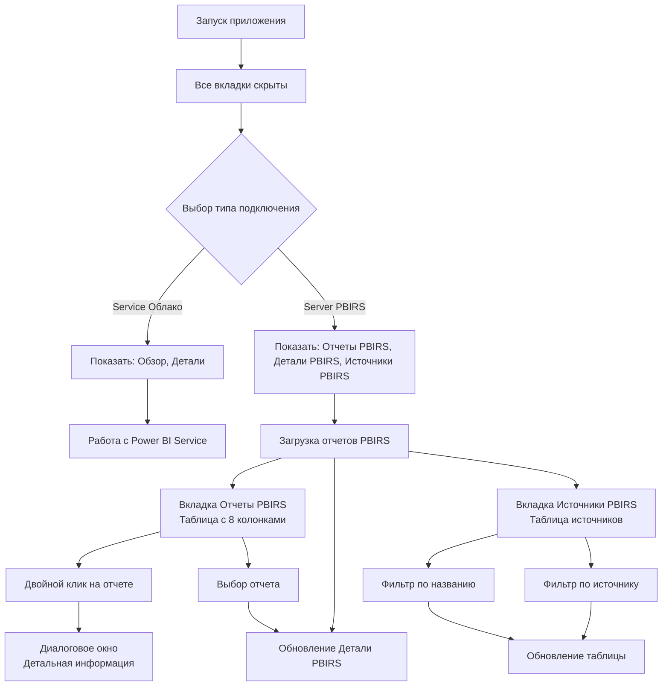

# План реализации расширенных функций для Power BI Report Server

## Обзор
Расширение функциональности для Power BI Report Server с добавлением новых вкладок, диалогового окна и расширенной информацией об отчетах на основе предоставленного скрипта.

## Требования

### 1. Основная вкладка "Отчеты PBIRS" (обновленная)
**Колонки таблицы:**
1. Папка
2. Название отчета
3. Размер (МБ)
4. Тип отчета (Power BI / Paginated Report / Linked Report)
5. Источники данных (кратко, через запятую)
6. Последний статус (из истории расписания)
7. Последнее обновление (дата/время последнего успешного обновления)
8. Следующее обновление (вычисляется на основе расписания, формат как в облачном варианте)

**Функциональность:**
- Двойной клик на отчете открывает детальную панель (диалоговое окно)
- Выбор отчета обновляет вкладку "Детали PBIRS"

### 2. Детальная панель при двойном клике на отчете (диалоговое окно)
Отображает полную информацию о выбранном отчете в модальном диалоге:
- Основные данные: ID, путь, создатель, дата создания
- Тип отчета (детальный: PowerBIReport или SSRSReport)
- Все источники данных (с ConnectionString, каждый на новой строке)
- Все расписания обновления кэша с деталями (каждое расписание на новой строке):
  - Описание расписания
  - Дата начала
  - Дата окончания
  - Периодичность (разбор Recurrence)
  - Последний запуск и статус
  - История выполнения (последние 5 записей)

### 3. Отдельная вкладка "Детали PBIRS"
Постоянная вкладка, отображающая детальную информацию о выбранном отчете:
- Те же данные, что и в диалоговом окне, но в постоянном виде
- Возможность сравнения нескольких отчетов (сохранение состояния)
- Дополнительные функции: экспорт данных, копирование информации

### 4. Отдельная вкладка "Источники PBIRS"
**Колонки таблицы:**
1. Папка
2. Название отчета
3. Источник данных (имя)
4. ConnectionString (усеченный)

**Фильтры на вкладке:**
- Фильтр по названию отчета (существующий)
- Фильтр по источникам данных (новый, фильтрует отчеты по наличию определенного источника)

### 5. Управление видимостью вкладок
- При запуске программы все вкладки скрыты
- При выборе подключения "Облако" (service): показываются только вкладки "Обзор" и "Детали"
- При выборе подключения "Report Server" (server): показываются только вкладки "Отчеты PBIRS", "Детали PBIRS" и "Источники PBIRS"

## Архитектурные решения

### 1. Расширение модели данных
Требуется расширить структуру данных отчетов PBIRS для хранения:
- `CreatedBy` (создатель)
- `DataSources` (список источников данных с деталями)
- `CacheRefreshPlans` (список расписаний с разобранными полями Schedule)
- `LastRunStatus` и `LastRunTime` (из истории)
- `NextRunTime` (вычисленное следующее обновление)

### 2. Интеграция скрипта
Адаптировать функции из предоставленного скрипта:
- `get_reports_by_type()` - для получения расширенных данных (PowerBIReports и Reports)
- `extract_schedule_details()` - для разбора расписаний
- `get_cache_refresh_plans_for_report()` - для загрузки расписаний и истории
- `parse_recurrence()` - для преобразования Recurrence в читаемый формат

### 3. Вычисление следующего обновления
Реализовать функцию вычисления следующей даты/времени обновления на основе:
- StartDateTime (дата начала расписания)
- EndDate (дата окончания, если есть)
- Recurrence (периодичность)
- Последний запуск (из History)
- Формат отображения как в облачном варианте (например: "Завтра, 10:30" или "28.05.2026, 14:00")

### 4. Структура вкладок и окон
Будет 5 вкладок в общей структуре:
0. Обзор (только для service)
1. Детали (только для service)
2. Отчеты PBIRS (только для server)
3. Детали PBIRS (только для server)
4. Источники PBIRS (только для server)

Плюс модальное диалоговое окно `ReportDetailsDialog` для детального просмотра при двойном клике.

## План реализации

### Этап 1: Подготовка и расширение клиента PBIRS
1. **Модификация `PowerBIReportServerClient`**:
   - Добавить метод `get_extended_reports()` для получения отчетов с расширенными данными
   - Интегрировать логику получения CacheRefreshPlans и History из скрипта
   - Добавить кэширование для производительности

2. **Создание модуля утилит**:
   - `src/utils/schedule_parser.py` - функции `parse_recurrence()`, `extract_schedule_details()`
   - `src/utils/next_run_calculator.py` - функция `calculate_next_run()`
   - `src/utils/pbirs_data_enricher.py` - обогащение данных отчетов

### Этап 2: Обновление основной вкладки "Отчеты PBIRS"
1. **Модификация `create_pbirs_reports_tab()`** в `ui_panels.py`:
   - Обновить количество колонок с 6 до 8
   - Обновить заголовки колонок согласно требованиям
   - Добавить обработчик двойного клика для открытия диалогового окна
   - Добавить обработчик выбора отчета для обновления вкладки "Детали PBIRS"

2. **Обновление `update_pbirs_reports_table()`** в `main_window.py`:
   - Принимать расширенные данные отчетов
   - Заполнять новые колонки (Источники данных, Последний статус, Последнее обновление, Следующее обновление)
   - Форматировать данные для отображения (краткий формат источников данных)

### Этап 3: Создание диалогового окна детальной информации
1. **Создание `src/ui/report_details_dialog.py`**:
   - Наследование от `QDialog`
   - Форма с полями для основных данных отчета
   - Таблица для источников данных (с колонками: Имя, ConnectionString)
   - Таблица для расписаний (с колонками: Описание, Дата начала, Дата окончания, Периодичность, Последний запуск, Статус)
   - Кнопки "Закрыть", "Копировать", "Экспорт"

2. **Реализация логики отображения**:
   - Метод `show_report_details()` в `main_window.py` для открытия диалога
   - Обработчик двойного клика `on_pbirs_report_double_clicked()`

### Этап 4: Создание вкладки "Детали PBIRS"
1. **Создание метода `create_pbirs_details_tab()`** в `ui_panels.py`:
   - Аналогичная структура диалоговому окну, но в виде вкладки
   - Добавить кнопку "Обновить" для ручного обновления
   - Добавить чекбокс "Автообновление при выборе отчета"

2. **Реализация логики обновления**:
   - Метод `update_pbirs_details()` в `main_window.py` для заполнения данных
   - Обработчик выбора отчета на вкладке "Отчеты PBIRS"

### Этап 5: Создание вкладки "Источники PBIRS"
1. **Создание метода `create_pbirs_sources_tab()`** в `ui_panels.py`:
   - Таблица с 4 колонками (Папка, Название отчета, Источник данных, ConnectionString)
   - Два фильтра: QLineEdit для названия отчета и QComboBox для выбора источника данных
   - Кнопка "Обновить источники"

2. **Реализация фильтрации**:
   - Метод `update_pbirs_sources_table()` для заполнения таблицы
   - Логика фильтрации по двум критериям (название отчета и источник данных)

### Этап 6: Управление видимостью вкладок
1. **Расширение `update_tabs_visibility()`** в `main_window.py`:
   - Добавить логику для скрытия всех вкладок при запуске (initial state)
   - Управлять видимостью 5 вкладок в зависимости от режима
   - Обновить индексы вкладок с учетом новых

2. **Обновление логики переключения режимов**:
   - В `_reset_backend_for_mode_switch()` вызывать обновление видимости вкладок
   - Сбрасывать данные на скрытых вкладках

### Этап 7: Интеграция и тестирование
1. **Тестирование загрузки данных**:
   - Проверить работу с реальным PBIRS
   - Обработать ошибки и edge cases (отсутствие расписаний, ошибки API)

2. **Тестирование интерфейса**:
   - Проверить фильтрацию на всех вкладках
   - Проверить вычисление следующего обновления
   - Проверить отображение детальной информации в диалоге и вкладке
   - Проверить переключение между режимами service/server

## Файлы для изменения

### Основные файлы:
1. `src/core/powerbi_report_server_client.py` - расширение клиента
2. `src/ui/ui_panels.py` - создание новых вкладок и обновление существующих
3. `src/ui/main_window.py` - обновление методов и добавление обработчиков
4. `src/operations/pbirs_operations.py` - интеграция расширенной загрузки данных
5. `src/operations/ui_operations.py` - обновление управления видимостью

### Новые файлы:
1. `src/ui/report_details_dialog.py` - диалоговое окно детальной информации
2. `src/utils/schedule_parser.py` - утилиты для разбора расписаний
3. `src/utils/next_run_calculator.py` - вычисление следующего обновления
4. `src/utils/pbirs_data_enricher.py` - обогащение данных отчетов

## Диаграмма workflow

## Риски и решения

### Риск 1: Производительность при загрузке расширенных данных
**Решение**: 
- Использовать фоновую загрузку с прогресс-баром
- Кэшировать данные на уровне сессии
- Загружать детали расписаний только по требованию (ленивая загрузка)

### Риск 2: Дублирование кода между диалогом и вкладкой
**Решение**:
- Создать общий базовый класс или компонент для отображения деталей
- Вынести общую логику в отдельные функции
- Использовать один и тот же источник данных

### Риск 3: Управление состоянием UI при переключении режимов
**Решение**:
- Четкое разделение данных между режимами
- Сброс состояния при переключении
- Валидация перед отображением

### Риск 4: Формат отображения дат и времени
**Решение**:
- Использовать единый форматтер дат как в облачном варианте
- Локализация для русского языка
- Четкое отображение относительного времени ("Завтра", "Через 2 часа")

## Следующие шаги
1. Утверждение плана пользователем
2. Переключение в режим Code для начала реализации
3. Последовательная реализация этапов согласно плану