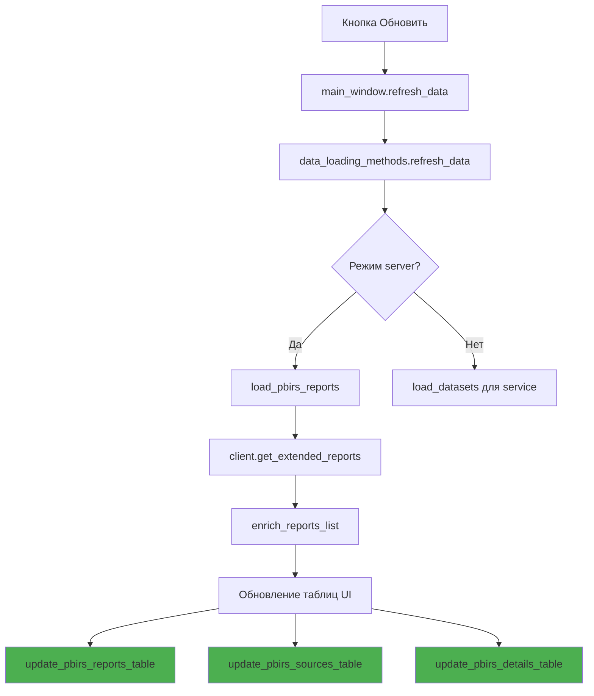

# План исправления ошибки обновления данных в режиме PBIRS

## Описание проблемы

При нажатии кнопки "Обновить" в режиме PBIRS возникают две ошибки:

### Ошибка 1: 404 при запросе DataSources
```
Ошибка 404 при запросе к http://localhost/Reports/api/v2.0/reports('a5730c22-5987-465c-af80-57c9b328ea08')/DataSources
```

**Причина:** В методе [`get_report_data_sources`](src/core/powerbi_report_server_client.py:427) используется endpoint `reports('{report_id}')/DataSources`, который предназначен для SSRS-отчётов. Для Power BI отчётов (PowerBIReports) нужно использовать endpoint `PowerBIReports({report_id})/DataSources`, как это сделано в других методах этого же класса (например, [`get_cache_refresh_plans`](src/core/powerbi_report_server_client.py:331) и в [`get_extended_reports`](src/core/powerbi_report_server_client.py:299-301)).

### Ошибка 2: `'str' object has no attribute 'get'`
```
✗ Ошибка при обновлении данных: 'str' object has no attribute 'get'
```

**Причина:** В методе [`refresh_data`](src/operations/data_loading_ops.py:100-104) вызывается `get_report_data_sources_for_table`, который возвращает **строку** (форматированное описание источников), но эта строка передаётся в [`update_pbirs_sources_table`](src/ui/main_window.py:391), который ожидает **список словарей** и вызывает `.get()` на каждом элементе.

## План исправления

### Шаг 1: Исправить endpoint в `get_report_data_sources`

**Файл:** [`src/core/powerbi_report_server_client.py`](src/core/powerbi_report_server_client.py)

**Изменение:** В методе `get_report_data_sources` (строка 439) заменить endpoint с `reports('{report_id}')/DataSources` на `PowerBIReports({report_id})/DataSources`.

```python
# Было:
data = self._make_request(f"reports('{report_id}')/DataSources")

# Стало:
data = self._make_request(f"PowerBIReports({report_id})/DataSources")
```

### Шаг 2: Исправить вызов `update_pbirs_sources_table` в `refresh_data`

**Файл:** [`src/operations/data_loading_ops.py`](src/operations/data_loading_ops.py)

**Изменение:** В методе `refresh_data` (строки 100-104) заменить вызов `get_report_data_sources_for_table` (который возвращает строку) на использование уже загруженных данных `self.main_window.pbirs_sources_data`.

```python
# Было:
sources_data = self.main_window.pbirs_operations.get_report_data_sources_for_table(
    self.main_window.pbirs_reports[0].get('Id') if self.main_window.pbirs_reports else ''
)
self.main_window.update_pbirs_sources_table(sources_data)

# Стало:
if hasattr(self.main_window, 'pbirs_sources_data'):
    self.main_window.update_pbirs_sources_table(self.main_window.pbirs_sources_data)
```

### Шаг 3 (опционально): Улучшить обработку ошибок в `get_report_data_sources`

**Файл:** [`src/core/powerbi_report_server_client.py`](src/core/powerbi_report_server_client.py)

**Изменение:** В методе `get_report_data_sources` добавить fallback — если запрос к `PowerBIReports({id})/DataSources` не удался, попробовать `reports('{id}')/DataSources` для SSRS-отчётов.

## Схема потока вызовов



## Проверка исправления

1. Запустить приложение
2. Переключиться в режим PBIRS
3. Подключиться к серверу
4. Нажать кнопку "Обновить"
5. Убедиться, что:
   - Нет ошибки 404 в логах
   - Нет ошибки `'str' object has no attribute 'get'`
   - Таблицы отчетов, источников данных и деталей обновляются корректно