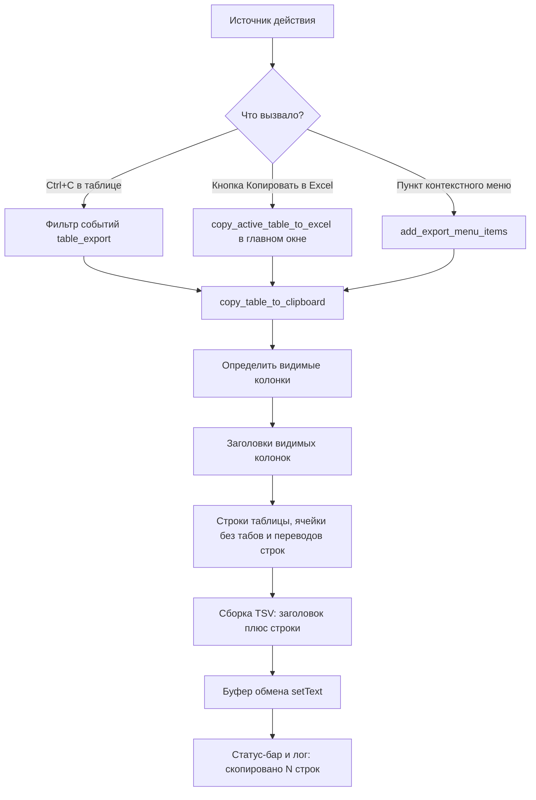

# План: Ctrl+A и копирование в Excel на вкладках результатов

## 1. Цель

На каждой вкладке результатов приложения Power BI Dataset Monitor & Manager:

1. **Ctrl+A** — выделить все отфильтрованные (видимые) строки активной таблицы.
2. **Копирование в Excel** — поместить содержимое активной вкладки результатов в
   буфер обмена в формате TSV (заголовки колонок + данные, только видимые колонки),
   чтобы оно корректно вставлялось в Excel.

Функционал должен быть доступен **тремя способами**:

- горячие клавиши: `Ctrl+A` (выделить все), `Ctrl+C` (копировать);
- кнопка **«Копировать в Excel»** в верхней панели (копирует активную вкладку);
- **контекстное меню** правой кнопкой мыши: пункты «Выделить все» и «Копировать в Excel».

## 2. Текущее состояние

| Вкладка | Таблица (виджет) | Колонок | Режим выбора | Контекстное меню |
|---|---|---|---|---|
| Обзор | `dataset_table` | 7 (колонка 2 «ID датасета» скрыта) | ExtendedSelection | есть (`show_context_menu`) |
| Детали | — | — | — | — |
| Отчёты PBIRS | `pbirs_reports_table` | 8 | ExtendedSelection | есть метод, но НЕ подключён к таблице |
| Источники PBIRS | `pbirs_sources_table` | 7 | ExtendedSelection | нет |
| Детали PBIRS | `pbirs_refresh_plans_table` | 5 | **SingleSelection** (Ctrl+A не сработает) | есть (`show_pbirs_refresh_plans_context_menu`) |

Ключевые наблюдения:

- Таблицы заполняются **уже отфильтрованными** данными: фильтры применяются до
  наполнения таблиц (`apply_filters` → `update_*_table`), поэтому «отфильтрованные
  значения» = все строки таблицы. `selectAll()` по таблице решает задачу выделения.
- Встроенный `Ctrl+C` в `QTableWidget` копирует выделенные ячейки **с заголовками**
  и **без скрытых колонок** (например, скрытую колонку «ID датасета») — это
  главный дефект для вставки в Excel.
- Обработчиков клавиатуры (QShortcut / keyPressEvent), буфера обмена и экспорта
  в коде нет — функционал полностью новый.
- Таблица расписаний на вкладке «Детали PBIRS» использует SingleSelection —
  требуется переключить на ExtendedSelection.
- Контекстное меню таблицы отчётов PBIRS (`show_pbirs_reports_context_menu`) уже
  написано в `ui_operations.py`, но не подключено к виджету.

## 3. Архитектура решения

Новый модуль **`src/ui/table_export.py`** — единая точка логики выделения и
копирования. Он предоставляет:

- `install_table_export(table)` — вешает на таблицу объектный фильтр событий
  (сохраняется в атрибуте таблицы, чтобы не был собран GC), перехватывающий
  `Ctrl+A` и `Ctrl+C` только когда фокус находится в таблице (поля фильтров
  `QLineEdit` не затрагиваются — там сохраняется штатное поведение);
- `copy_table_to_clipboard(table)` — сборка TSV из **видимых** колонок
  (заголовки + строки, санитизация `\t`/`\r\n` внутри ячеек) и запись в буфер
  обмена через `QApplication.clipboard()`; возвращает количество строк;
- `select_all_rows(table)` — `table.selectAll()`;
- `add_export_menu_items(menu, table)` — добавляет в готовый `QMenu` пункты
  «Выделить все» (Ctrl+A) и «Копировать в Excel» (Ctrl+C) с разделителем.

Поток копирования:

Кнопка «Копировать в Excel» обращается к реестру **«вкладка → таблица
результатов»**, хранящемуся в главном окне, и определяет активную таблицу по
текущему индексу `tab_widget`.

## 4. Шаги реализации

### Шаг 1. Новый модуль `src/ui/table_export.py`

- Класс `TableExportFilter(QObject)` с `eventFilter`:
  - `KeyPress` + `ControlModifier` + `Qt.Key.Key_A` → `select_all_rows(table)`,
    вернуть `True` (событие поглощено);
  - `KeyPress` + `ControlModifier` + `Qt.Key.Key_C` → `copy_table_to_clipboard(table)`,
    вернуть `True` (штатное копирование Qt не выполняется — иначе попадёт скрытая
    колонка и не будет заголовков).
- `copy_table_to_clipboard(table)`:
  - собрать индексы видимых колонок (`not table.isColumnHidden(col)`);
  - первая строка — заголовки видимых колонок
    (`table.horizontalHeaderItem(col).text()`);
  - каждая следующая строка — `table.item(row, col).text()` (пустая строка, если
    ячейки нет), с заменой `\t`, `\r`, `\n` на пробел;
  - склейка колонок `\t`, строк `\n`;
  - `QApplication.clipboard().setText(text)`;
  - возврат числа скопированных строк данных.
- `add_export_menu_items(menu, table)` — добавляет `QAction("Выделить все")` и
  `QAction("Копировать в Excel")` с разделителем; короткие клавиши показываются
  в тексте пунктов.

### Шаг 2. Подключение обработчика клавиш в `src/ui/ui_panels.py`

После создания каждой таблицы результатов вызвать
`install_table_export(...)`:

- `dataset_table` (создание в `create_overview_tab`);
- `pbirs_reports_table` (в `create_pbirs_reports_tab`);
- `pbirs_sources_table` (в `create_pbirs_sources_tab`);
- `pbirs_refresh_plans_table` (в `create_pbirs_details_tab`).

Добавить импорт `from .table_export import install_table_export`.

### Шаг 3. ExtendedSelection для таблицы расписаний

В `create_pbirs_details_tab` для `pbirs_refresh_plans_table` установить
`setSelectionMode(QAbstractItemView.SelectionMode.ExtendedSelection)` рядом с
существующим `setSelectionBehavior(...)`, чтобы `selectAll()` выделял все строки.

### Шаг 4. Существующие контекстные меню в `src/operations/ui_operations.py`

В конце функций (перед `menu.exec(...)`):

- `show_context_menu` (таблица датасетов): добавить
  `add_export_menu_items(menu, self.main_window.dataset_table)`; при вызове из
  дерева (`sender != dataset_table`) пункты не добавлять.
- `show_pbirs_refresh_plans_context_menu`: добавить
  `add_export_menu_items(menu, self.main_window.pbirs_refresh_plans_table)`.

### Шаг 5. Контекстные меню отчётов и источников PBIRS

- `pbirs_reports_table`: в `ui_panels.py` подключить существующий
  `customContextMenuRequested` → `main.show_pbirs_reports_context_menu`
  (метод уже есть в `ui_operations.py`); в конце этого метода добавить
  `add_export_menu_items(menu, self.main_window.pbirs_reports_table)`.
- `pbirs_sources_table`: добавить политику
  `CustomContextMenu` и новый метод `show_pbirs_sources_context_menu` в
  `ui_operations.py` (пункты «Выделить все» и «Копировать в Excel» через
  `add_export_menu_items`); делегировать из главного окна
  (`PowerBIMonitorUI.show_pbirs_sources_context_menu`).

### Шаг 6. Реестр вкладок и метод копирования в `src/ui/main_window.py`

- В `init_ui` (или `__init__`) создать реестр:
  `self.result_tables = {}` — индекс вкладки `tab_widget` → таблица.
- Заполнить реестр в `create_center_panel` (в `ui_panels.py`) после создания
  вкладок: вкладка 0 → `dataset_table`, вкладка 2 → `pbirs_reports_table`,
  вкладка 3 → `pbirs_sources_table`, вкладка 4 → `pbirs_refresh_plans_table`.
- Метод `PowerBIMonitorUI.copy_active_table_to_excel()`:
  - определить `current_index = self.tab_widget.currentIndex()`;
  - взять таблицу из реестра; если таблицы нет (вкладка «Детали») — сообщение
    в статус-бар «На этой вкладке нет таблицы результатов» и выход;
  - вызвать `copy_table_to_clipboard(table)`;
  - показать в статус-баре и логе «Скопировано в буфер обмена: N строк».

### Шаг 7. Кнопка «Копировать в Excel» в `src/ui/ui_toolbars.py`

В `create_button_panel` добавить кнопку **«Копировать в Excel»** (в правую группу
кнопок, рядом с «Тестовые данные»), подключить к
`self.main.copy_active_table_to_excel()`.

### Шаг 8. Граничные случаи

- Пустая таблица: копируются только заголовки, в статус-бар «Таблица пуста,
  скопированы заголовки».
- Вкладка «Детали»: нет таблицы результатов — сообщение, ничего не копируется.
- Поля фильтров (`QLineEdit`/`QComboBox`): `Ctrl+A`/`Ctrl+C` работают штатно
  (фильтр событий установлен только на таблицы).
- Сортировка (двойной клик по заголовку): `QTableWidget.sortItems` переставляет
  элементы модели, копирование идёт в текущем порядке сортировки.
- Ячейки с символами `\t`/переносами (например, полные ConnectionString в
  tooltip не попадают, но текст ячейки может содержать переводы) — заменяются
  на пробелы при сборке TSV.
- Кириллица: `QClipboard.setText` использует Unicode — вставка в Excel корректна.

### Шаг 9. Тестирование

1. Запустить приложение (`python main.py`), загрузить тестовые данные
   («Тестовые данные»).
2. Применить фильтры (чекбоксы левой панели, фильтр по названию) — проверить,
   что в таблице остались только отфильтрованные строки.
3. `Ctrl+A` на вкладке «Обзор» — выделены все строки таблицы.
4. `Ctrl+C` → вставить в Excel: заголовки на месте, скрытой колонки ID нет,
   кириллица корректна.
5. Кнопка «Копировать в Excel» — копирует активную вкладку независимо от фокуса.
6. Контекстное меню правой кнопкой на каждой из 4 таблиц: пункты «Выделить все»
   и «Копировать в Excel» присутствуют и работают; в меню таблицы датасетов
   существующие пункты (вкл/выкл автообновление и т.д.) не сломаны.
7. Вкладка «Детали»: Ctrl+C/кнопка дают информативное сообщение.
8. Проверить режим server (PBIRS): вкладки «Отчёты», «Источники», «Детали PBIRS».

## 5. Затрагиваемые файлы

| Файл | Действие |
|---|---|
| `src/ui/table_export.py` | создать (новый модуль) |
| `src/ui/ui_panels.py` | подключить `install_table_export`, ExtendedSelection для планов, контекстное меню таблицы отчётов, реестр вкладок, меню источников |
| `src/operations/ui_operations.py` | добавить пункты экспорта в `show_context_menu`, `show_pbirs_refresh_plans_context_menu`, `show_pbirs_reports_context_menu`; новый `show_pbirs_sources_context_menu` |
| `src/ui/main_window.py` | реестр `result_tables`, метод `copy_active_table_to_excel()`, делегат `show_pbirs_sources_context_menu` |
| `src/ui/ui_toolbars.py` | кнопка «Копировать в Excel» |

Существующая функциональность (фильтры, обновления, расписания, контекстные
меню операций) не меняется — новые пункты добавляются в конец меню.